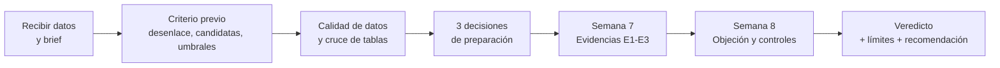

# Contrato que crece
### Expediente D · SECOP II · Bogotá D.C. 2024–2025

**Data Analytics (43390860) · Universidad Central · 2026-2 · Equipo 7**
_Integrantes: Juan Felipe Garavito - Juan Fernando Fonseca - Cristian Villamil_

---

## En una frase
Los contratos de mayor valor inicial y los del sector Salud bajo régimen especial reciben con más frecuencia ampliaciones de plazo. La afirmación queda **parcialmente respaldada**: se probó para **días adicionados**, no para adiciones de dinero.

## Veredicto y cifras clave

| | Resultado |
|---|---|
| **Veredicto** | Parcialmente respaldada |
| Contratos con días adicionados | **26,8 %** de 49.432 analizados |
| Valor inicial (cuartil más bajo → más alto) | **19,5 % → 32,4 %**; se mantiene al controlar por modalidad, tipo, sector, duración, año y mes (razón de momios 1,35) |
| Salud bajo régimen especial | **68,4 %** (n = 5.345) frente a 21,8 % en el resto |
| Duración pactada | Asociación débil e inestable (ρ = 0,05) |

**Recomendación al cliente (firma de interventoría ficticia):** priorizar la revisión de contratos de mayor valor inicial y del sector Salud bajo régimen especial como candidatos a ampliación de plazo. Es una señal de priorización, no una predicción individual ni una prueba de irregularidad.

---

## Dinámica del proyecto

El trabajo siguió el ciclo que pide la actividad: **criterio primero, evidencia después, objeción al final**.



| Etapa | Qué se hizo | Producto |
|---|---|---|
| **1. Encuadre** | Se leyó el brief y se fijó *antes* de mirar resultados cómo medir la adición, qué características evaluar y qué diferencia se considera relevante (≥ 10 puntos porcentuales o \|ρ\| ≥ 0,10) | Sección «Criterio previo» del notebook |
| **2. Calidad y cruce** | Se revisaron ceros, extremos y duraciones; se construyó y verificó la llave `id_contrato` entre contratos y adiciones | Sección «Relacionar contratos y adiciones» |
| **3. Decisiones** | Tres decisiones de preparación, cada una con evidencia y riesgo si fuera equivocada | Sección «Tres decisiones de preparación» |
| **4. Semana 7** | Tres evidencias: frecuencia de la adición (E1), valor inicial (E2), sector y modalidad (E3) | Tablero de evidencia |
| **5. Semana 8** | Se puso a prueba la objeción «el valor solo refleja modalidad o sector» con comparaciones estratificadas y un modelo logístico; se revisó la sensibilidad | Sección «Segunda semana» |
| **6. Cierre** | Veredicto, limitaciones, recomendación, diseño para evidencia causal y declaración de IA | Evidence Card final |

### Las dos trampas del brief y cómo se resolvieron

1. **Trampa de escala.** El brief pide analizar la adición como proporción del valor inicial, no en pesos. La tabla de adiciones no trae montos, así que no se pudo calcular; se usó la proporción de **días adicionados sobre la duración pactada**. Es la mayor limitación del análisis.
2. **Trampa del cruce.** La llave `id_contrato` es válida, pero la tabla de adiciones cubre solo **114 de 50.000 contratos (0,23 %)** y pierde 13.279 contratos con días adicionados. Usarla como desenlace habría cambiado la conclusión completa, por lo que se dejó como fuente complementaria.

### Tres decisiones que cambiaron el resultado

| Decisión | Por qué importa |
|---|---|
| **El desenlace es `dias_adicionados`, no la tabla de adiciones** | Con la tabla la tasa de adición sería 0,23 % en lugar de 26,8 % |
| **La duración se mide con la duración pactada, no con las fechas de fin** | Las fechas se actualizan con las prórrogas: con ellas la duración parecía el mejor predictor (ρ = 0,28) y el valor perdía su asociación; era en gran parte un efecto mecánico |
| **Se excluyen 568 contratos (valor 0 o duración no interpretable); los extremos se conservan** | Se usan cuartiles, correlaciones por rangos y logaritmos, y se verificó que quitar el 1 % superior no cambia el resultado |

### Cómo respondió el análisis a la objeción
El valor **no** era un simple reflejo de la modalidad o del sector: su razón de momios pasa de 1,31 (sola) a 1,35 tras controlar. Lo que sí cambió es la lectura de la modalidad: dentro del régimen especial el valor casi no discrimina. El gradiente aparece en 2024 y en 2025.

---

## Alcance y límites
- **Solo ampliaciones de tiempo**, no adiciones presupuestales (falta el monto).
- **Muestra truncada:** 50.000 de 567.075 contratos, con criterio de selección desconocido; no se generaliza a todo SECOP II.
- **Asociación, no causalidad:** no se midió la complejidad del objeto contractual ni la práctica de cada entidad. La tasa de 2025 (31,9 %) es mayor que la de 2024 (21,6 %) sin explicación disponible.

## Próximos pasos
1. Obtener los montos de adición para probar la afirmación completa.
2. Repetir el análisis dentro de cada entidad (efectos fijos).
3. Validar con contratos firmados después del recorte.

---

## Contenido del repositorio
```
├── SECOP_ExpedienteD_Equipo7.ipynb   # análisis completo, ejecutado
├── data/                             # CSV, metadatos y README de datos
├── reports/                          # tablero de evidencia y resumen ejecutivo
├── requirements.txt
└── GIT_COMMANDS.md                   # guía de commits, tags y releases
```

## Reproducir
```bash
python -m venv .venv && source .venv/bin/activate    # Windows: .venv\Scripts\activate
pip install -r requirements.txt
jupyter lab SECOP_ExpedienteD_Equipo7.ipynb            # Kernel → Restart & Run All
```
El notebook debe estar junto a la carpeta `data/`.

## Uso de IA
Se empleó Claude (Anthropic) para apoyar el código y los borradores de texto. La verificación y las decisiones del equipo están declaradas en el notebook y en el tablero; los campos marcados «Confirmar por el equipo» deben completarse antes de la entrega.
